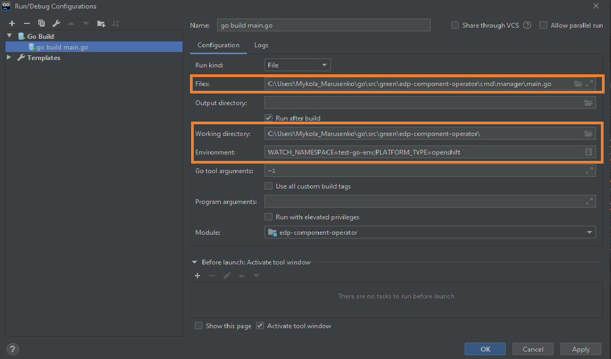

# EDP Component Operator

EDP component operator is an extension for K8S/OpenShift that is used for managing the EDP CI/CD components in the Admin Console tool.

At the moment, it is delivered as a Custom Resource Definition without any controllers.
Some of EDP components are predefined and installed automatically. 

Additionally, there is the ability to use the custom components and afterwards consume the respective component data from Admin Console. 

The basic Custom Resource for EDP Component cab be as follows:
```yaml
apiVersion: v1.edp.epam.com/v1alpha1
kind: EDPComponent
metadata:
  name: example-edpcomponent
spec:
  type: jenkins
  url: https://example-jenkins
  icon: base64encoded_icon
```

_**NOTE:** Pay attention to the icon field that should be a base64 encoded._

As soon as the CR is created, it will appear on the main page of the Admin Console tool:


# How to Install Operator

EDP installation can be applied on two container orchestration platforms: OpenShift and Kubernetes.

_**NOTE:** Installation of operators is platform-independent, that is why there is a unified instruction for deploying._

### Prerequisites
1. Linux machine or Windows Subsystem for Linux instance with [kubectl](https://kubernetes.io/docs/tasks/tools/install-kubectl/) installed with an authorized access to the cluster;
2. Admin space is deployed by following one of the instructions: [edp-install-openshift](https://github.com/epmd-edp/edp-install/blob/master/documentation/openshift_install.md#admin-space) or [edp-install-kubernetes](https://github.com/epmd-edp/edp-install/blob/master/documentation/kubernetes_install.md#admin-space).

### Installation
* Go to the [releases](https://github.com/epmd-edp/edp-component-operator/releases) page of this repository, choose a version, download an archive and unzip it;

_**NOTE:** It is highly recommended to use the latest released version._

* Go to the unzipped directory and apply all files with the Custom Resource Definitions resource:
```bash
for file in $(ls deploy/crds/*_crd.yaml); do kubectl apply -f $file; done
```

# Local Development
## Requirements:
* Go version (great than 1.13)

_**NOTE**: Make sure that environment variable GOPATH and GOROOT are added in PATH:_
```
export GOPATH=C:\Users\<<username>>\go
export GOROOT=C:\Go
```

* Configured access to the VCS (see [Gerrit Setup for Developer](https://kb.epam.com/display/EPMDEDP/Gerrit+Setup+for+Developer))
* GoLand Intellij Idea or another IDE

### Running operator:
1. Clone repository
2. Open folder in GoLand Intellij Idea and select Add Configuration → Go Build
 
3. Set the path to the main.go file in Files field, path to the Working directory for operator and set Specify a platform name (OpenShift/Kubernetes) and selected namespace in Environment tab
 
4. Run 'go build main.go' (Shift+F10)
5. Check the operator logs in output console 
```
{"level":"info","ts":1580909580.038896,"logger":"cmd","msg":"Go Version: go1.13.7"}
{"level":"info","ts":1580909580.0398724,"logger":"cmd","msg":"Go OS/Arch: windows/amd64"}
{"level":"info","ts":1580909580.0398724,"logger":"cmd","msg":"Version of operator-sdk: v0.8.0+git"}
{"level":"info","ts":1580909580.0408487,"logger":"leader","msg":"Trying to become the leader."}
{"level":"info","ts":1580909580.0408487,"logger":"leader","msg":"Skipping leader election; not running in a cluster."}
{"level":"info","ts":1580909582.473165,"logger":"cmd","msg":"Registering Components."}
```

### Exceptional Cases
After starting Go build process you see the following error: 
```
go: finding github.com/openshift/api v3.9.0
go: finding github.com/openshift/client-go v3.9.0
go: errors parsing go.mod:
C:\Users\<<username>>\Desktop\EDP\edp-admin-console\go.mod:36: require github.com/openshift/api: version "v3.9.0" invalid: unknown revision v3.9.0

Compilation finished with exit code 1
```

This problem can resolve by manual update go dependency using golang command:
```
go get github.com/openshift/api@v3.9.0
```
