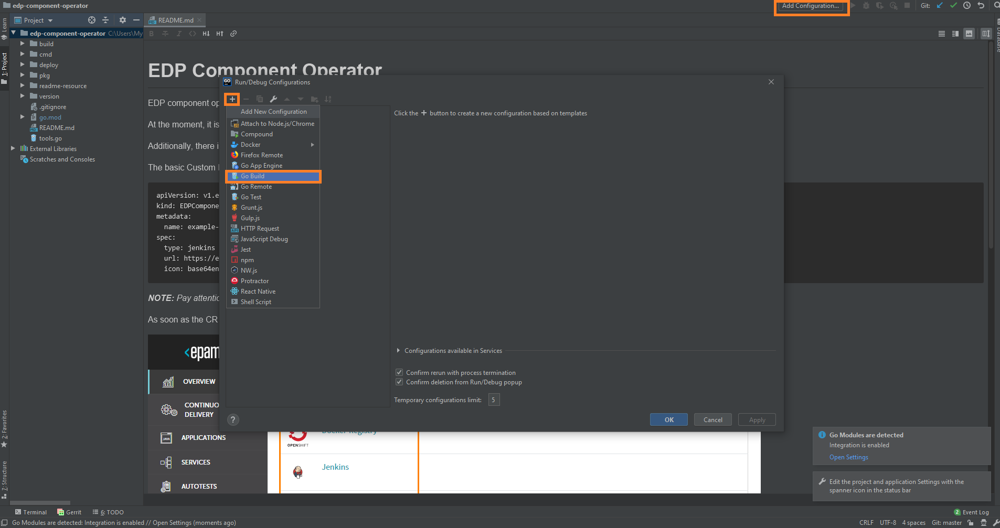
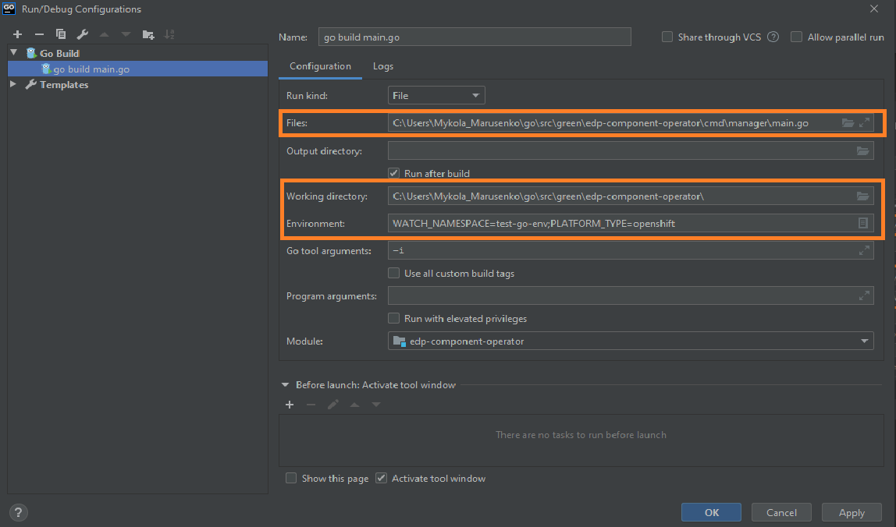

# Local Development
## Requirements:
* Go version (great than 1.13)

_**NOTE**: Make sure that environment variable GOPATH and GOROOT are added in PATH:_
```
export GOPATH=C:\Users\<<username>>\go
export GOROOT=C:\Go
```

* Configured access to the VCS (see [Gerrit Setup for Developer](https://kb.epam.com/display/EPMDEDP/Gerrit+Setup+for+Developer))
* GoLand Intellij Idea or another IDE

### Running operator:
1. Clone repository
2. Open folder in GoLand Intellij Idea and select Add Configuration → Go Build
 
3. Set the path to the main.go file in Files field, path to the Working directory for operator and set Specify a platform name (OpenShift/Kubernetes) and selected namespace in Environment tab
 
4. Run 'go build main.go' (Shift+F10)
5. Check the operator logs in output console 
```
{"level":"info","ts":1580909580.038896,"logger":"cmd","msg":"Go Version: go1.13.7"}
{"level":"info","ts":1580909580.0398724,"logger":"cmd","msg":"Go OS/Arch: windows/amd64"}
{"level":"info","ts":1580909580.0398724,"logger":"cmd","msg":"Version of operator-sdk: v0.8.0+git"}
{"level":"info","ts":1580909580.0408487,"logger":"leader","msg":"Trying to become the leader."}
{"level":"info","ts":1580909580.0408487,"logger":"leader","msg":"Skipping leader election; not running in a cluster."}
{"level":"info","ts":1580909582.473165,"logger":"cmd","msg":"Registering Components."}
```

### Exceptional Cases
After starting Go build process you see the following error: 
```
go: finding github.com/openshift/api v3.9.0
go: finding github.com/openshift/client-go v3.9.0
go: errors parsing go.mod:
C:\Users\<<username>>\Desktop\EDP\edp-admin-console\go.mod:36: require github.com/openshift/api: version "v3.9.0" invalid: unknown revision v3.9.0

Compilation finished with exit code 1
```

This problem can resolve by manual update go dependency using golang command:
```
go get github.com/openshift/api@v3.9.0
```